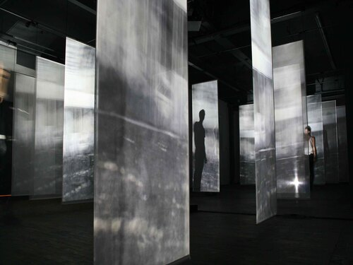
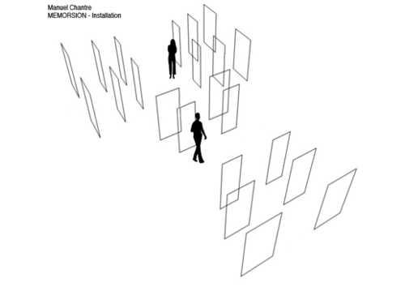
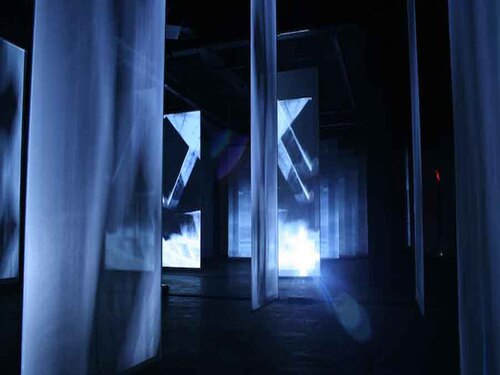
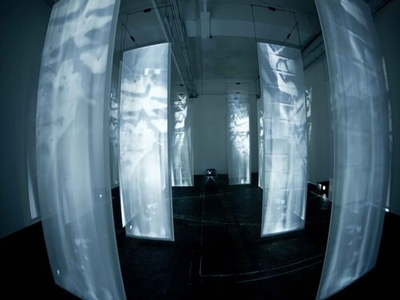
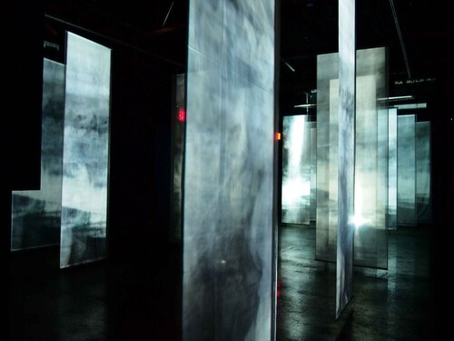

# Memorsion - Manuel Chantre
*Fusion de la Mémoire et de la Distorsion*

## Qui?
---
### Artistes

- **Auteur, Vidéo, musique, programmation et conception :** Manuel Chantre

### Équipe de production 

- **Assistante au tournage, au montage et à la production :** Hortense Le Forestier De Quillien
- **Collaboration à la programmation:** Éric Andrade et Nathanaël Lécaudé du Studio imaginaire
- **Figuration :** Roxanne Belanger, Lucia Carballo, Katty Daelman, Benjamin Michaud, Karolina Montana, Claude Paradis
- **Confection tissu :** Nicole Cantin 
- **Consultant dispositif :** Sébastien Dallaire
- **Consultante matériaux :** Isabelle Kaliaguine
- **Collaboration au tournage :** Francis Pineau 

### Partenaire
- [Eastern Bloc](https://www.easternbloc.ca/)

### Collaborateurs
- [Société des arts technologiques](https://sat.qc.ca/)
- [Prim](https://primcentre.org/) (Version 1.2) 
  
### Contribution
- Programme de résidence-expo de Vidéographe

## Quand?
---
### Date de création 
- **2010**

### Date de première présentation 
- **3 au 21 juin 2010**, du lundi au samedi, de 10h à 18h.

### Dates et lieux importants

- **375e Anniversaire de Montréal**, Une île, 19 plages–un million d’horizons, Maison de la culture Ahuntsic-Cartierville, Montréal (CA), été 2017
- **Société des arts technologiques**, 20ème anniversaire de la SAT, Montréal (CA), 2015
- Société des arts technologiques, Nuit Blanche, Montréal (CA), 2014
- **PAVED Arts**, exposition en solo, Saskatoon (CA), 2014
- **Mapping Festival**, Centre d’art contemporain de Geneve, Genève (CH), (performance et installation), 2011
- **Festival du Nouveau Cinéma**, (performance), Montreal (CA), 2010
- **Eastern Bloc**, exposition en solo, Montréal (CA), 2010, lundi au samedi, 10h à 18h
- **Vernissage de Memorsion**, Eastern Bloc, 3 juin 2010, 18h à 21h

### Prix 
- Artiste de la relève 2010 pour Memorsion : **Chantal L’Heureux**, chroniqueuse arts visuels, Montréal (CA), 2011

## Où ?
---
### Lieu de présentation initiale 

- EASTERN BLOC
   - 7240 rue Clark, 2e étage, Montréal, QC 

### Contexte géographique et culturel 

##### Cadre culturel
Diplômé en sciences humaines, Manuel Chantre remet en question la culture comme **construction humaine** en créant des environnements non linéaires où les spectateurs apportent leurs propres expériences et interprétations.
  
##### Cardre géographique
L'œuvre de Manuel Chantre, centrée sur l'architecture et l'**environnement urbain**, place ces espaces comme des créations humaines malléables que les spectateurs réinterprètent subjectivement à travers leurs propres expériences.

## Quoi ?
---
### Description générale
***Memorsion*** est une installation immersive avec une vingtaine de toiles de projection où le public, en se déplaçant, modifie le contenu visuel, explorant la mémoire des lieux urbains à travers des images de structures, d'édifices abandonnés et de graffitis, créant un espace fictif.

### Objectifs de l'œuvre

#### Expérience
Manuel Chantre vise à éveiller chez le public des **souvenirs personnels** liés à des lieux urbains similaires, en utilisant des éléments architecturaux pour refléter l'influence des espaces sur la mémoire et les émotions, incitant ainsi les adultes à se reconnecter à leur vécu émotionnel.

#### Message

> "The statement behind this is to **see** the buildings **as they are**, **without** people inside"   *Manuel Chantre*
>
>> «L'idée sous-jacente est de **voir** les bâtiments **tels qu'ils sont**, **sans** personne à l'intérieur»   *Manuel Chantre*

Son intention est de provoquer une **prise de conscience** sur la manière dont nous habitons ces espaces, en soulignant leur caractère subjectif et modifiable plutôt que purement concret et immuable.

### Public cible 

Il cherche à faire réfléchir le public (adultes) sur le fait que les lieux ont une **existence propre, indépendamment des gens qui y vivent, mais qu'ils racontent aussi les histoires de ceux qui les habitent.**

### Aspects techniques

#### Matériaux

- 24 écrans de projection en polyester
- Tuyaux en aluminium
- Cordes en polyester
- 4 à 6 haut-parleurs
- 1 à 2 haut-parleurs de basses fréquences
- 4 projecteurs
- 1 ordinateur
- 1 logiciel multimédia
- 1 caméra infrarouge et lampe infrarouge
- Tissus

#### Images et scènes

Les images en noir et blanc de Memorsion, transformées par des techniques de 2D et de 3D, sont saccadées et clignotantes, interrompues par des lignes horizontales vacillantes, avec un **« œil »** de caméra qui se déplace de manière fluide, saccadée ou presque violente.

### Processus de création

***Memorsion***, développée par Manuel Chantre, poursuit l'exploration de ***Dispergere Maiz (2009)*** avec une installation audiovisuelle immersive sur 22 toiles de projection. En automne 2012, Chantre complète le projet avec une **compilation des musiques** sous la forme innovante d’un bloc en béton, évitant le format CD obsolète.

## Comment ?
---
### Composante centrale

#### Les projecteurs

**Variabilité des projections :** Tous les projecteurs ne montrent pas la même image en même temps ; il y a des variations, des relations, et des chevauchements, permettant de voir une **scène à travers une autre**.

**Interaction avec le public :** En se déplaçant à travers ***Memorsion***, le spectateur s'**immerge** dans le monde visuel de la même manière qu'il est projeté sur les écrans. 

### Fonctionnement

#### Projections déclenchées par le mouvement 

Memorsion utilise des projections interactives déclenchées par les mouvements des spectateurs, offrant des images et sons uniques selon leur navigation.

### Impact 

#### Projections déclenchées par le mouvement 

La composante centrale de ***Memorsion***, des projections activées par le **mouvement**, dévoile des fragments d'espaces abandonnés et d'architectures montréalaises déformés, créant un « sens de l'intemporalité » qui immerge le spectateur et l'invite à se **« perdre »** dans l'œuvre.

> «Le monde compare l’installation à un labyrinthe, à une maison de miroirs.»   *Manuel Chantre*

#### Distinction dans le paysage multimédia 

***Memorsion*** se distingue par ses projections interactives qui, influencées par les mouvements des spectateurs, transforment des scènes quotidiennes et éléments architecturaux familiers en un **« lieu nulle part »**, issu de l'imagination culturelle.

> «C’était l’idée de laisser aux gens de découvrir certains lieux et de **réfléchir** à l’architecture.»   *Manuel Chantre*

## Appréciation et commentaire personnel
---
J'apprécie ***Memorsion*** pour sa capacité à offrir une expérience immersive personnalisée, où l'abstraction et la familiarité se mêlent pour inciter chaque spectateur à réfléchir profondément sur sa relation intime et subjective avec les environnements urbains. 

## Sources
---
[Site Manuel Chantre](http://www.manuelchantre.com/memorsion/)  
[Shadow on the wall](http://www.manuelchantre.com/wp-content/uploads/2014/07/2014_Verb_MacPherson_Memorsion16.jpg)  
[Site Manuel Chantre](http://www.manuelchantre.com/memorsion/)  
[Présentation docuement - Manuel Chantre](http://www.manuelchantre.com/wp-content/uploads/2014/10/2010_Document_de_pr%C3%A9sentation_vid%C3%A9ographe_eastern_bloc_Memorsion_Web-121.pdf)  
[Paved Arts](https://www.pavedarts.ca/2013/memorsion/)  
[Entrevue - Manuel Chantre](http://www.manuelchantre.com/wp-content/uploads/2014/07/2012_M%C3%A9dium_saignant_Manuel_Chantre-3.pdf)  
[Mermorsion description](https://e-artexte.ca/id/eprint/29273/1/Memorsion_description_eng.pdf)  
[Article - Manuel Chantre](http://www.manuelchantre.com/wp-content/uploads/2014/07/2014_A_Word_Gazzola_Memorsion.pdf)  
[Document de présentation](http://www.manuelchantre.com/wp-content/uploads/2014/10/2010_Document_de_présentation_vidéographe_eastern_bloc_Memorsion_Web-121.pdf)  
[Entrevue Youtube](https://www.youtube.com/watch?v=XdfaI-GKwW0)  
[Entrevue Vimeo](https://vimeo.com/32464821)  